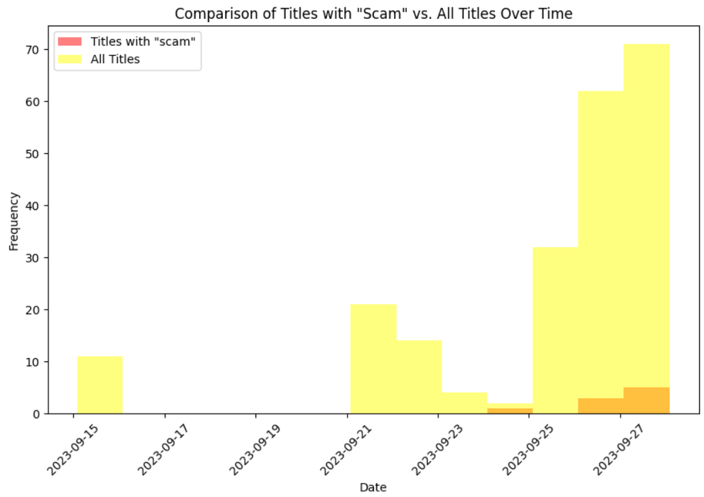
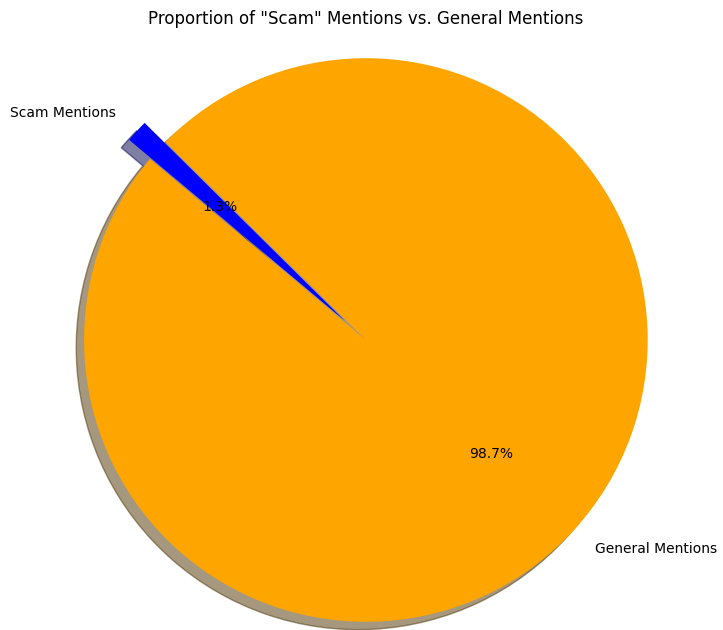

## Binance

### Entity type: Cryptoexchange

#### Associated scams

##### 2022-01-07

Pakistan's Federal Investigation Agency (FIA) Cyber Crime Wing has issued a notice to Binance, a major cryptocurrency exchange, as part of a multi-million dollar scam investigation. The FIA is probing Binance's involvement with fraudulent online investment mobile applications. Ponzi schemes operated through these apps, promising high returns and causing significant financial losses once they amassed substantial capital. Each app had around 5,000 customers on average, with estimated losses nearing $100 million.

The FIA is taking various steps to investigate the scam further, including blocking Pakistani bank accounts linked to the apps and contacting Telegram for admin details. They've also identified suspect blockchain wallet addresses connected to Binance and requested information from the exchange. Binance is described as the "largest unregulated virtual currency exchange" in Pakistan. The FIA expects Binance to cooperate in tracking financial crimes; otherwise, they may recommend financial penalties through the State Bank of Pakistan.

##### 07-02-2022

Pakistan's Federal Investigation Agency (FIA) Cyber Crime Wing has issued a notice to an official from Binance, a prominent cryptocurrency exchange, as part of a multi-million dollar scam investigation involving fraudulent online investment mobile applications. The FIA aims to clarify Binance's connection to these apps. The scam, resembling Ponzi schemes, promises high returns to investors who bring in new clients and then vanishes once a substantial capital base is built. On December 20, 2021, numerous mobile apps, including MCX, HFC, and others, defrauded people of billions of rupees. Additionally, Binance's CEO, Changpeng Zhao, warned users about a phishing scam via SMS targeting the exchange, advising users not to click on such links. Crypto-related scams and heists remain prevalent in the industry, with hackers exploiting vulnerabilities and targeting decentralized finance (DeFi) platforms, among others, resulting in significant financial losses for users.

The bar plot below illustrates the proportion of mentions related to scams involving Binance Cryptoexchange in Google News between January 1, 2022, and June 30, 2022. A total of 533 mentions were collected during this period.

The pie chart below illustrates that, between January 1, 2022, and June 30, 2022, 1.3% of the mentions of Binance Cryptocurrency Exchange in Google News were related to scams.:

