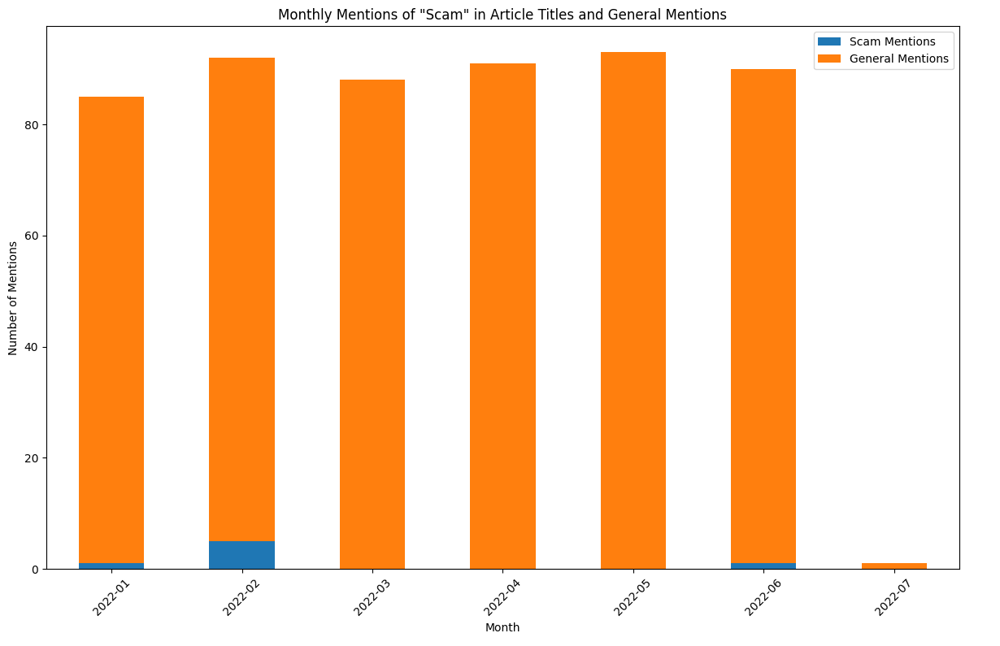

#        Report

## Introduction

The most challengeable was to find the best free API for extracting news articles which let to cover yearly period and to retrieve more than thousand articles. I googled for different APIs, and encountered ApiNews, Guardian, RapidApi, New York Times. The coolest tool seemed to be RapidApi, since the site said it was a hub for APIs that help you to discover and connect to thousands of APIs. However, unfortunately, it turns out that there are limits for batch extraction - up to 50 articles, and time limit - not later than a month from a current time. All my attempts can be seen in the file 'Сrypto_project - trials.ipynb'.

Finally, I found the python library named as GoogleNews which gave me 55 350 articles in total.

## Analysis

So I retrieved 55 350 rows with title that contain word 'crypto', date and link (url) columns. I was happy, but when I was starting doing EDA, I noticed that unique titles only 299. Only 0.5% of data was fruitful.

I tried to find out the reason, wanted to get more data. But failed. And decided to analyze this 299 articles.

So this articles were issued between 15.09.2023 and 29.09.2023. Actually I put a larger period, but there is a limit.

Make a histogram where all titles are compared with the titles that contain "scam". "Scam" articles were issued only three days, below the histogram.

   

To understand the share of 'scam' about articles, I made a pie chart, where we can see that only 3.5% of all articles contain in the title 'scam' word.

